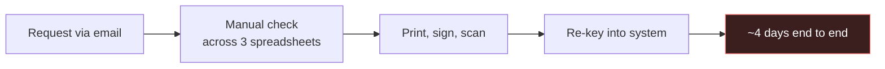
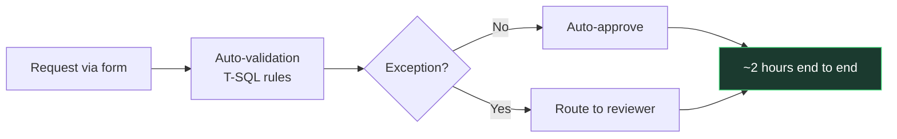
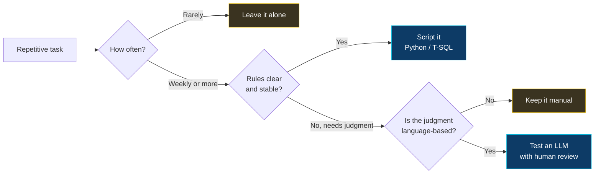

  

  

  

    
    
    
  

---

Business Analyst. I write the documents that turn "we need a system for this" into something a developer can actually build.

Most of my work is unglamorous — sitting with users, mapping what they actually do versus what the SOP says they do, then writing it down properly. The gap between those two is where most project failures live.

Lately I've been learning AI workflows and defensive security. Not to switch careers. Because when a stakeholder asks "can AI do this?" or "is this data safe?", I'd rather answer than nod and take a note.

---

### Case: Approval Workflow

An internal approval process that took four days. Most of that was waiting, not working.

**Before**

The re-keying step was the one everyone complained about. It was not the real problem. The real problem was that nobody could tell where a request was sitting, so people chased it by email and the queue never cleared.

**After**

Roughly 70% of requests matched clean rules and no longer needed a human. The remaining 30% went to a reviewer with the validation results already attached. Names and figures are generalised.

---

### How I Decide What to Automate

Two of the four outcomes are "don't automate." That ratio is roughly accurate in practice.

---

### Things I Learned the Hard Way

| What happened | What I do now |
|---|---|
| Wrote an FSD from the SOP without watching the actual process. Half the requirements were wrong by UAT. | I sit with users before writing anything. The SOP is a starting hypothesis, not a source. |
| Took UAT sign-off as proof the users understood the change. They signed to end the meeting. | Sign-off requires them to run their own scenario, not the one I prepared. |
| Automated a monthly report nobody was reading. Saved four hours a year. | I ask who reads the output before I touch the process that produces it. |

---

### Stack

| | |
|---|---|
| **Documentation** | BRD, FSD, use case specs, process maps |
| **Tools** | JIRA, Confluence, Visio, Excel |
| **Data** | T-SQL, SQL Server — reconciliation and integrity checks |
| **Testing** | SIT coordination, UAT facilitation, defect tracking |
| **Learning** | Python, LLM APIs, security fundamentals |

---

### Learning Log

Updated when something is actually finished.

| Topic | Where I'm at |
|---|---|
| LLM API integration | Built a few working scripts. See `llm-doc-drafter`. |
| Prompt design for business tasks | Understand what works. Still learning what breaks. |
| Agentic workflows | Reading. Nothing built yet. |
| Security fundamentals | Can follow a threat model conversation. Can't lead one. |
| Threat modeling | Early. Mostly reading case studies. |
| Python for data work | Pandas, file handling, API calls. No production code. |

---

Open to Business Analyst roles, process improvement projects, and requirements consulting. Based in Jakarta.

Fastest reply via [email](mailto:riowicaksono.work@gmail.com) or [LinkedIn](https://linkedin.com/in/riowicaksono).

   
  

