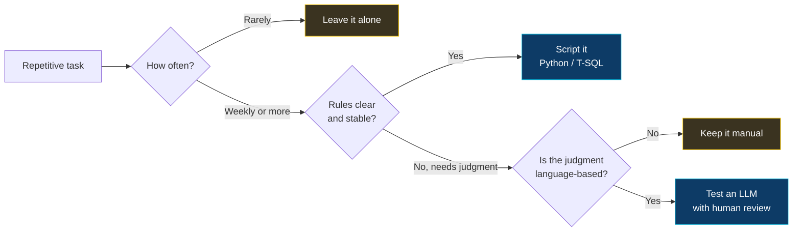

  

  

  

    
    
    
  

---

Business Analyst based in Jakarta. I write the documents that turn "we need a system for this" into something a developer can actually build.

Most of the work is unglamorous — sitting with users, mapping what they actually do versus what the SOP says they do, then writing it down properly. The gap between those two is where most project failures live.

I'm also learning AI workflows and defensive security. Not to switch careers. When a stakeholder asks "can AI do this?" or "is this data safe?", I'd rather answer than nod and take a note.

---

### What I Work On

**Requirements and specifications**

BRD and FSD documents, use case specs, process maps. The templates I use are in [`brd-template`](https://github.com/thevoidsyntax/brd-template), trimmed down from the bloated versions most organisations hand out — most sections in a standard template get filled with "N/A" and reviewers stop reading by page four.

**Data validation**

T-SQL for reconciliation and integrity checks. Row counts after migration, duplicates on business keys, orphan records, amount reconciliation. Scripts in [`sql-recon-scripts`](https://github.com/thevoidsyntax/sql-recon-scripts). These answer the question that comes up in every UAT: is this number actually right?

**Testing and rollout**

SIT coordination, UAT facilitation, defect tracking in JIRA. Every requirement gets at least one negative and one boundary case — positive-only coverage is how defects reach production.

---

### How I Decide What to Automate

Two of the four outcomes are "don't automate." That ratio is roughly accurate in practice.

---

### Two Things I Built While Learning

**[`Access-Matrix-Auditor`](https://github.com/thevoidsyntax/Access-Matrix-Auditor)** — reads a role-permission matrix and reports where one role holds both sides of a control that should be split. Run against a sample finance matrix of six roles and sixteen permissions, it found eight high-severity conflicts.

The interesting failure is the System Admin role. It trips five rules, and it should — an admin holds everything by definition. A tool that flags it every run is a tool people stop reading. Accepting known exceptions with a written reason is what this needs next, and it's the reason most audit tooling gets ignored.

**[`LLM-Doc-Drafter`](https://github.com/thevoidsyntax/LLM-Doc-Drafter)** — takes raw meeting notes and produces a first-draft set of user stories and open questions. The draft is wrong often enough that shipping it unreviewed would be worse than writing from scratch. The value is in the open-questions section: the model is reliably good at spotting what the notes did not say, and unreliable at deciding what the requirement should be.

---

### Stack

| | |
|---|---|
| **Documentation** | BRD, FSD, use case specs, process maps |
| **Tools** | JIRA, Confluence, Visio, Excel |
| **Data** | T-SQL, SQL Server |
| **Testing** | SIT coordination, UAT facilitation, defect tracking |
| **Learning** | Python, LLM APIs, access control review |

---

### Learning Log

| Topic | Where I'm at |
|---|---|
| LLM API integration | Written and dry-run tested. See `LLM-Doc-Drafter`. |
| Access control review | Built an SoD checker. See `Access-Matrix-Auditor`. |
| Prompt design for business tasks | Understand what works. Still learning what breaks. |
| Threat modeling | Reading. Nothing built yet. |
| Python for data work | Comfortable with CSV and file handling. No production code. |

Most of what I produce doesn't live on GitHub. It lives in Confluence, in requirement documents, and in the ninety minutes I spend watching someone do their job before I write a single line about it.

---

Open to Business Analyst roles, process improvement projects, and requirements consulting.

Fastest reply via [email](mailto:riowicaksono.work@gmail.com) or [LinkedIn](https://linkedin.com/in/riowicaksono).

   
  

